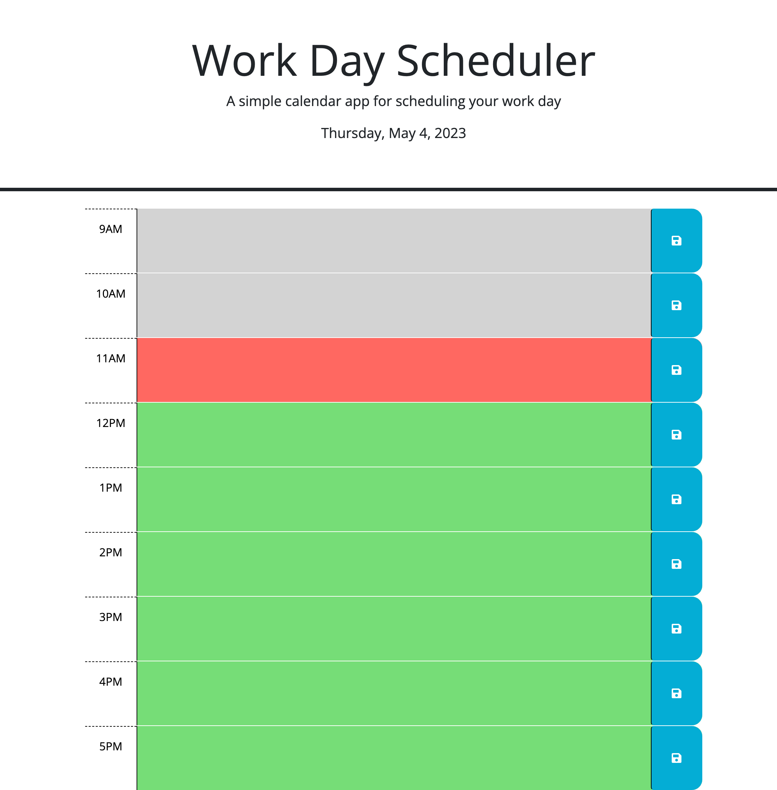

Title: Work Day Scheduler

Description: This is a dynamic app designed for scheduling in a normal 9-5 routine at work. You can save things you have to do and refresh the page and have them still be there. The time slots will change based on whether it is in the past present or future and will refresh on the hour every hour. I used jquery because I wanted the page to update dynamically. I faced the challenge of gettiing all the timeblocks onto the page without using the index and have the classes change appropriately also took me awhile to figure out to use backquotes instead of individual strings in the JS. I made multiple versions and clashed notes from both that were working at the end and took out the things that weren't working to make a condensed and completed version.

How to Use: Open up the page click on any box you want to schedule something for enter the description and hit the save button on the right.

License:N/A

Link to application: https://nporter619.github.io/Work-Day-Scheduler/

Screenshot: 